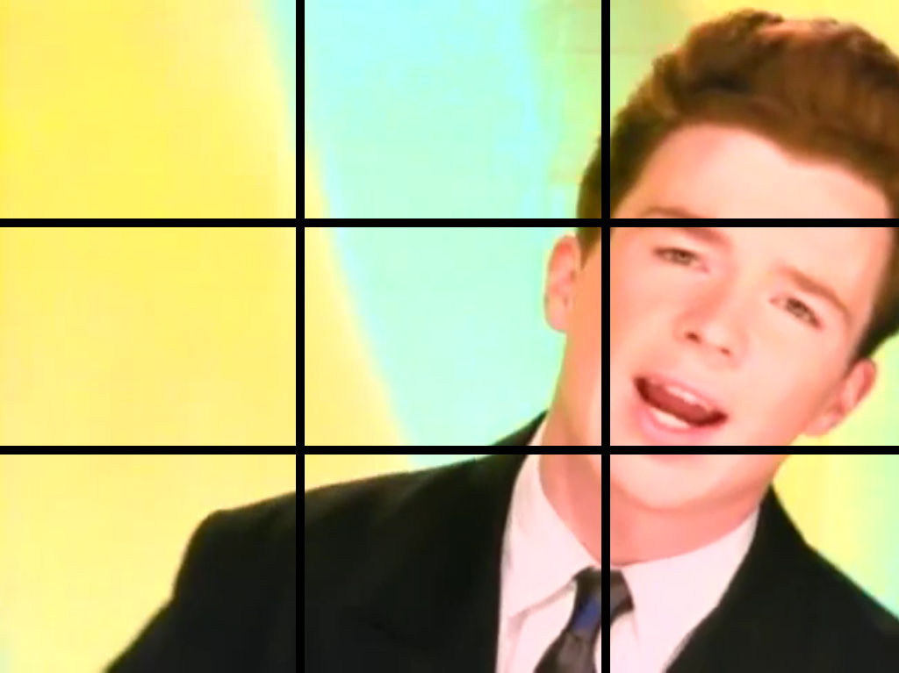

Simulate a multi-monitor video wall using HTML video and canvas

* Specify grid size
* Trigger effects with keystrokes
* Customize your own effects plugins

  
  

The `canvas.html` file plays from one `<video>` source at a time, and sets up a grid on a corresponding `<canvas>` to display portions of the video and perform effects.

A first attempt in `video.html` used multiple `<video>` elements but they can become out of sync as the video plays. However, this may be useful for playing multiple different videos at once.

Future enhancements:

* Playlist to queue videos
* Additional effects

Live demo: https://dysproseum.com/video-wall/canvas.html
